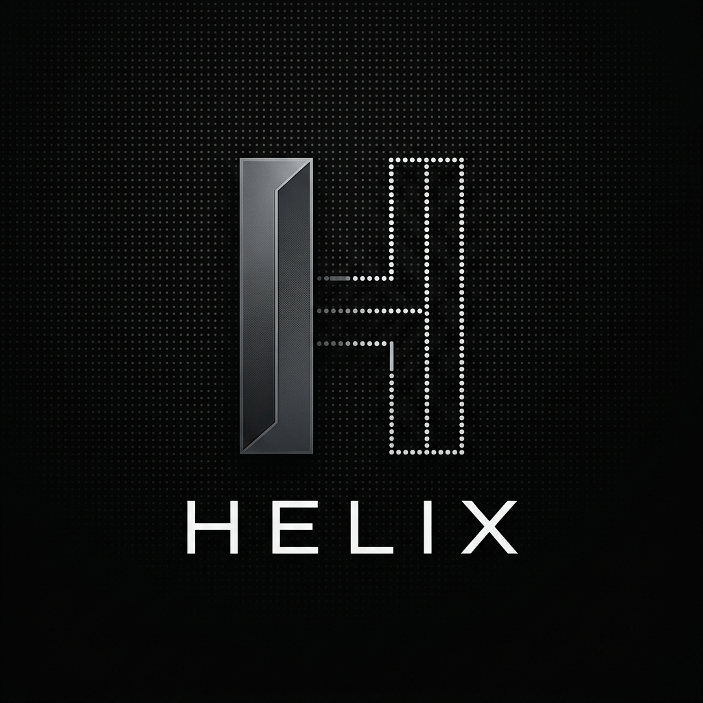

<div align="center">
  
  <h1>Helix</h1>
  <p>The world's most premium, AI-native project management platform.</p>
</div>

<br />

## 🪐 About Helix

Helix is a modern, high-performance project management platform built for speed, aesthetics, and intelligence. 

Inspired by industrial minimalism ("Nothing-tech"), Apple's craftsmanship, and the power of enterprise tools like Jira and Linear, Helix combines fluid interactions with an AI-first workflow. It replaces cluttered SaaS interfaces with deep charcoal tones, micro-animations, keyboard-first navigation, and a powerful WebGL-driven visual identity.

## ✨ Features

- **Industrial Aesthetic**: Deep monochrome contrast, ultra-subtle borders, and Framer Motion physics.
- **AI-Native Assistant**: Built-in AI to summarize issues, auto-generate cycles, and route tickets intelligently.
- **Fluid Workflows**: Real-time issue tracking, Kanban boards, and sprint cycles built for velocity.
- **Next-Gen Tech Stack**: Next.js 15 App Router, Tailwind CSS, Zustand, and Python/FastAPI backend.
- **Interactive WebGL**: Stunning background fluid animations powered by `ogl` and React Bits.

## 🚀 Getting Started

### Prerequisites
- Node.js 18+
- Python 3.10+
- Docker & Docker Compose (for PostgreSQL, Redis, MinIO)

### 1. Start the Infrastructure
```bash
docker compose up -d
```

### 2. Run the Backend
```bash
cd backend
poetry install
poetry run uvicorn src.main:app --reload --port 8000
```

### 3. Run the Frontend
```bash
cd frontend
npm install
npm run dev
```

Visit `http://localhost:3000` to experience Helix.

## 🛠 Tech Stack

**Frontend:**
- [Next.js](https://nextjs.org/) (React Framework)
- [Tailwind CSS](https://tailwindcss.com/) (Styling)
- [Framer Motion](https://www.framer.com/motion/) (Animations)
- [Zustand](https://zustand-demo.pmnd.rs/) (State Management)
- [ogl](https://github.com/oframe/ogl) (WebGL)

**Backend:**
- [FastAPI](https://fastapi.tiangolo.com/) (Python Web Framework)
- [PostgreSQL](https://www.postgresql.org/) (Database)
- [MinIO](https://min.io/) (Object Storage)
- [Redis](https://redis.io/) (Caching / PubSub)
